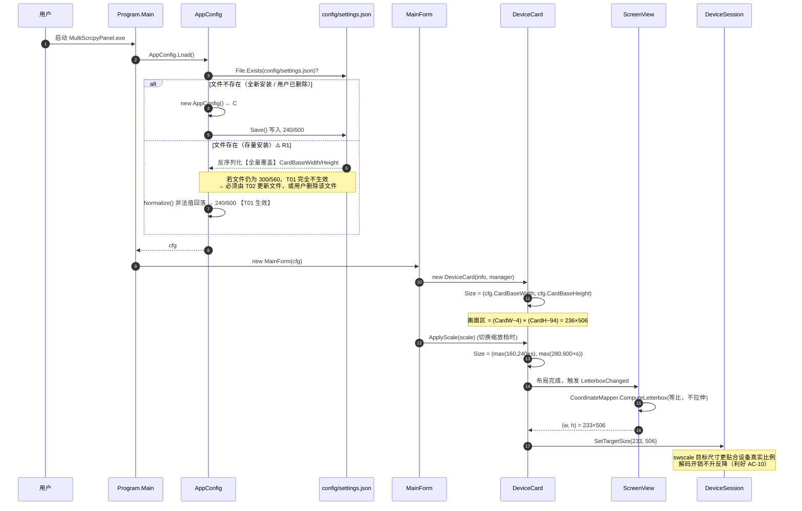
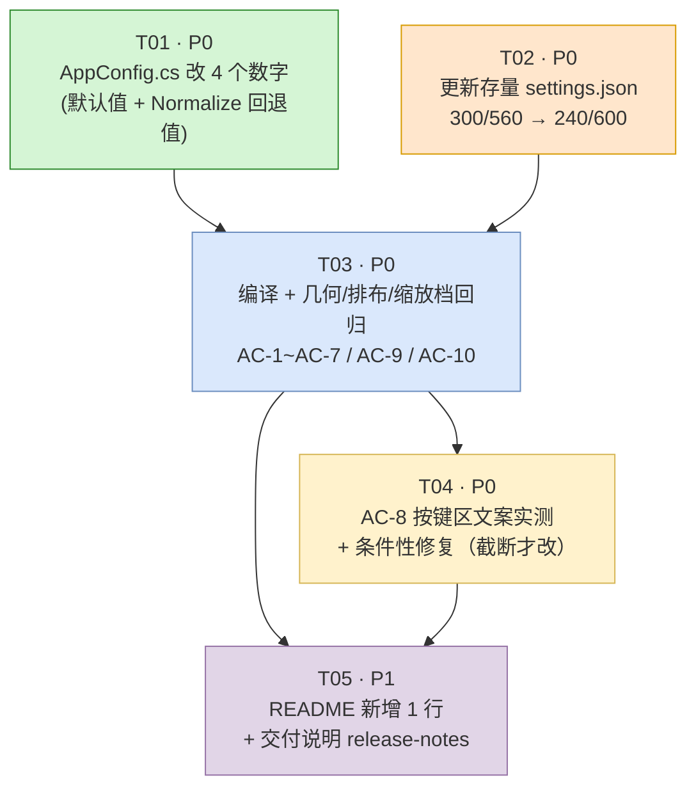

# 增量设计：设备卡片长屏比例适配（v1 首版）

| 项 | 内容 |
| --- | --- |
| 文档类型 | 增量架构设计 + 任务分解（仅描述变更部分） |
| 版本 | v1.0 |
| 作者 | 高见远（架构师） |
| 上游输入 | `docs/incremental-prd-aspect-ratio.md`（许清楚 · 产品经理） |
| 决策依据 | 主理人齐活林对 Q1~Q7 的拍板结论（见 §1.2） |
| 项目 | MultiScrcpyPanel（C# / .NET 8 / WinForms / x64） |
| 改动总量 | **AppConfig.cs 4 个数字 + settings.json 1 个文件（2 个数字）+ README 1 处文案 + 1 份交付说明** |
| 语言 | 中文 |

---

## 1. 实现方案

### 1.1 方案定性：常量调参，零架构变更

本版**不是架构改动，是一次受控的常量调参 + 交付动作**。核心判断链：

1. `ScreenView` + `CoordinateMapper.ComputeLetterbox` 的等比 letterbox 逻辑**是正确的**，黑边不是渲染 bug；
2. 黑边 100% 源于**卡片容器宽高比**（`r_card = 0.635`）与现代长屏手机（`r_dev ≈ 0.45~0.47`）不匹配；
3. 容器宽高比完全由 `AppConfig.CardBaseWidth / CardBaseHeight` 两个常量驱动，经 `DeviceCard` 构造函数与 `ApplyScale` 传导；
4. 因此**改这两个数字即可闭环**，无需触碰渲染层、协议层、布局层。

| 维度 | 结论 |
| --- | --- |
| 新增框架 / NuGet 依赖 | **无**（`MultiScrcpyPanel.csproj` 不动，仅 `FFmpeg.AutoGen 6.0.0.2` 保持原样） |
| 新增配置项 | **无**（复用已有 `CardBaseWidth` / `CardBaseHeight`） |
| 新增类 / 接口 / 方法 | **无** |
| 架构模式变化 | **无**（仍为 `UI → Core(DeviceManager/DeviceSession) → Protocol` 三层单向依赖） |
| 触碰渲染 / 协议层 | **否**（`ScreenView.cs`、`Protocol/CoordinateMapper.cs` 本版**确认不动**） |
| 触碰布局常量 | **否**（`TitleHeight=26`、`ButtonAreaHeight=64`、`FlowLayoutPanel` 均不动） |
| 编译风险 | 极低（4 个字面量替换，不改签名、不改类型） |
| 回滚成本 | 把 4 个数字改回 300/560 + 删除 `config/settings.json` 即可 |

> **设计铁律（本版必须守住）**：不为"少几个像素黑边"去动 letterbox；不为"按钮挤"去动 `ButtonAreaHeight`；不为"存量配置不生效"去写 `ConfigVersion` 迁移代码（那是 P1-4）。本版的价值在于**让用户尽快拿到可测的一版**，任何超出 4 个数字的改动都要先回来问主理人。

### 1.2 主理人拍板结论落地映射

| 问题 | 拍板结论 | 本设计的落地方式 |
| --- | --- | --- |
| Q1 目标比例 | 采纳 **240×600**（r_card ≈ 0.466） | T01 落地；§3.1 已复核几何 |
| Q2 50% 档畸变 | **本版不修**，留 P1 | 不进任务；T05 交付说明中标注为"已知存量缺陷，下版修复" |
| Q3 缩放档位 | **不加** 25% / 300% | `MainForm.cs:27` `ScaleOptions` 保持 `{50,75,100,150,200}` 不动 |
| Q4 按键截断 | 交付时**实测**，若截断优先"缩小字号"或"多任务→任务"，**不改 ButtonAreaHeight** | 独立任务 T04（条件性执行），§3.3 已给出预判与推荐方案 |
| Q5 存量 settings.json | **更新**（不删除）`bin\...\config\settings.json` 的两个字段；`ConfigVersion` 迁移放 P1-4 | T02 落地；T05 交付说明置顶提示 |
| Q6 平板 / 横屏 | 本版不优化，归 P2 | 不进任务；T05 交付说明注明 |
| Q7 README | 若提及默认卡片尺寸则同步 1 处 | T05 落地。**实测发现 README §4 配置表未收录该字段**，故动作调整为"新增 1 行"（详见 §2.3） |

### 1.3 数值传导链路（为什么改 2 个默认值就够）

```
AppConfig.CardBaseWidth/Height (默认值 240/600)
        │
        ├── AppConfig.Load() ──► 若 config/settings.json 存在，则被文件值【完全覆盖】  ← R1 风险点，由 T02 处理
        │        └── Normalize() ──► 非法值回落（回落值也必须是 240/600）              ← P0-2
        │
        ▼
DeviceCard 构造函数 (DeviceCard.cs:61)  Size = new Size(CardBaseWidth, CardBaseHeight)
        │
        ├── ApplyScale(scale) (DeviceCard.cs:256-261)  Size = (BaseW×s, BaseH×s)（带 160/280 下限钳制）
        │
        ▼
UserControl ClientSize = Size − 2（BorderStyle.FixedSingle）
        │
        ▼  Padding(1) → DisplayRectangle = ClientSize − 2
_root TableLayoutPanel（行：26 绝对 / 100% 弹性 / 64 绝对）
        │
        ▼
ScreenView 实际可绘区 = (CardW − 4) × (CardH − 94)     ← r_card 的真正定义域
        │
        ▼
ScreenView.CurrentLetterbox() → CoordinateMapper.ComputeLetterbox(等比，不拉伸)
        │
        ▼
DeviceCard.OnLetterboxChanged → DeviceSession.SetTargetSize(w, h) → swscale 目标尺寸
```

**副产品收益（无需额外改动）**：画面区变窄后 `SetTargetSize` 下发的解码目标更贴合设备真实比例，swscale 输出缓冲变小，单卡解码/缩放开销**不升反降**，有利于 AC-10。

### 1.4 关键技术复核：PRD 遗留的 4px 疑问已闭环

PRD §1.1 标注「架构师需按实际 `ClientRectangle` 复核那 4px」。**已复核，结论：确为 4px，PRD 公式成立，无需修正任何测算。**

依据（`DeviceCard.cs:58-62`、`92-106`）：

| 扣减项 | 来源代码 | 横向扣减 | 纵向扣减 |
| --- | --- | --- | --- |
| `BorderStyle = BorderStyle.FixedSingle` | `DeviceCard.cs:62` | 1px × 2 = 2 | 1px × 2 = 2 |
| `Padding = new Padding(1)` | `DeviceCard.cs:59` | 1px × 2 = 2 | 1px × 2 = 2 |
| `RowStyle(Absolute, TitleHeight=26)` | `DeviceCard.cs:101` | — | 26 |
| `RowStyle(Absolute, ButtonAreaHeight=64)` | `DeviceCard.cs:103` | — | 64 |
| `_root` / `_screen` 的 Margin、Padding | `DeviceCard.cs:80,97-98` | 0（均为 `Padding.Empty`） | 0 |
| **合计** | | **4** | **94** |

> WinForms 中 `UserControl` 继承自 `ScrollableControl`，`BorderStyle.FixedSingle` 属于**非客户区**，会从 `ClientSize` 中扣除（每边 1px），因此 `Size(240,600) → ClientSize(238,598) → DisplayRectangle(236,596)`。公式 `imgW = CardW − 4`、`imgH = CardH − 94` 成立。

---

## 2. 文件列表（本版全部涉及文件，相对项目根 `csharp/`）

| # | 相对路径 | 动作 | 改动量 | 所属任务 |
| --- | --- | --- | --- | --- |
| 1 | `MultiScrcpyPanel/AppConfig.cs` | 修改 | **4 个数字**（行 83、86、176、177） | T01 |
| 2 | `MultiScrcpyPanel/bin/x64/Debug/net8.0-windows/config/settings.json` | 修改 | 2 个数字（行 18、19） | T02 |
| 3 | `README.md` | 修改 | 1 处文案（§4 配置表） | T05 |
| 4 | `docs/release-notes-aspect-ratio.md` | **新建** | 1 份交付说明 | T05 |
| 5 | `MultiScrcpyPanel/UI/DeviceCard.cs` **或** `MultiScrcpyPanel/UI/UiTheme.cs` | **条件性修改** | ≤1 行，**仅当 AC-8 实测截断时** | T04（条件分支） |

### 2.1 明确不动的文件（防止工程师"顺手优化"）

| 相对路径 | 为什么不动 |
| --- | --- |
| `MultiScrcpyPanel/UI/ScreenView.cs` | letterbox 渲染逻辑本来就正确，改动只会引入回归 |
| `MultiScrcpyPanel/Protocol/CoordinateMapper.cs` | 同上；且触摸坐标映射依赖它，改动风险极高 |
| `MultiScrcpyPanel/UI/MainForm.cs` | `ScaleOptions`（行 27）本版不加档位（Q3）；`FlowLayoutPanel` 排布不动 |
| `MultiScrcpyPanel/UI/DeviceCard.cs` 的 `ApplyScale`（行 256-261） | `Math.Max(160,…)/Math.Max(280,…)` 下限是**存量缺陷**（P1-2），本版不修（Q2） |
| `MultiScrcpyPanel/UI/DeviceCard.cs` 的 `TitleHeight`/`ButtonAreaHeight`（行 22、25） | Q4 明令不改 |
| `MultiScrcpyPanel/MultiScrcpyPanel.csproj` | 无新依赖 |

### 2.2 关于 `config/settings.json` 的两个工程事实（工程师必读）

1. **该文件不是构建产物**。已核查 `MultiScrcpyPanel.csproj`，`config/` 目录**没有**任何 `None Include` / `CopyToOutputDirectory` 规则；它是 `AppConfig.Load()` 在文件不存在时通过 `fresh.Save(file)`（`AppConfig.cs:118`）运行时生成的。
   → **推论**：`dotnet build` / `rebuild` **不会**覆盖或删除它，改完即持久生效；反过来说，**光重新编译解决不了 R1，必须显式改文件**。
2. **程序运行时会回写整份配置**。`MainForm.cs:492` 在"选择截图目录"后调用 `_cfg.Save()`，会用**内存中的全部字段**重新序列化覆盖该文件。
   → **推论**：T02 必须在**程序已关闭**的状态下修改该文件，否则可能被运行中的实例回写覆盖。

### 2.3 关于 README 的实测偏差（Q7 的执行细化）

已 grep 核查 `README.md`：**§4「配置：`config/settings.json`」的字段表中根本没有 `cardBaseWidth` / `cardBaseHeight` 行**，全文亦无"300×560"等尺寸描述。

因此 Q7「同步更新那 1 处文案」的实际动作是：**在 §4 表格末尾新增 1 行**，把新默认值文档化（同时也为用户自助微调提供入口，支撑 US-3）。这仍然是"1 处文案改动"，改动量与主理人预期一致。

---

## 3. 关键数值复核（架构师独立验算，可直接作为 QA 对数表）

### 3.1 画面区几何与黑边（100% 档）

```
imgW = CardW − 4
imgH = CardH − 94
r_card = imgW / imgH
```

| 项 | 现状 300×560 | 新版 240×600 | 结论 |
| --- | --- | --- | --- |
| 画面区 | 296 × 466 | **236 × 506** | — |
| r_card | 0.6352 | **0.4664** | 命中目标 0.466 ✅ |
| 9:19.5（0.4615）实绘 | 215 × 466 | **233 × 506** | 面积 100,190 → 117,898，**+17.7%** ✅ AC-4 |
| 9:19.5 左右黑边 | 81px / 27.4% | **3px / 1.0%** | ✅ AC-1（≤5%） |
| 9:20（0.450）左右黑边 | 29.1% | **3.5%** | ✅ AC-2（≤8%） |
| 9:18（0.500）上下黑边 | 21.3%（侧） | **6.8%** | ✅ AC-3（≤8%） |

### 3.2 缩放档位对照表（新基准 240×600，`ApplyScale` 逻辑不变）

`w = Math.Max(160, round(240×s))`，`h = Math.Max(280, round(600×s))`

| 档位 | 卡片尺寸 | 是否触发下限钳制 | 画面区 | r_card | AC-6 判定（要求 0.43~0.50） |
| --- | --- | --- | --- | --- | --- |
| 50% | 160 × 300 | **宽被钳制**（120→160） | 156 × 206 | **0.757** | 已知存量缺陷，本版仅要求不崩溃/不拉伸 ⚠️ |
| 75% | 180 × 450 | 否 | 176 × 356 | 0.4944 | ✅ |
| 100% | 240 × 600 | 否 | 236 × 506 | 0.4664 | ✅ |
| 150% | 360 × 900 | 否 | 356 × 806 | 0.4417 | ✅ |
| 200% | 480 × 1200 | 否 | 476 × 1106 | 0.4304 | ✅（贴近下界 0.43，属预期） |

> 50% 档说明：宽度 120 被 `Math.Max(160, …)` 顶到 160，高度 300 未被 280 钳制，一宽一不钳 → 比例被强行拉胖到 0.757。这是**改动前就存在**的行为（旧基准下为 0.839），本版比现状**改善但未修复**，按 Q2 留 P1-2。**交付说明必须主动声明，避免用户误判为本次引入的 bug。**

### 3.3 按键区列宽与 AC-8 截断预判

按键区宽度传导（`DeviceCard.cs:281-290`、`UiTheme.cs:172-186`）：

```
_buttons 可用宽 = CardW − 4
减 TableLayoutPanel.Padding(2) 左右   → CardW − 8
÷ 4 列（各 25%）                      → 列宽 = (CardW − 8) / 4
减 Button.Margin(2) 左右              → 按钮实际可绘宽 = 列宽 − 4
```

| 档位 | 卡片宽 | 列宽 | 按钮实绘宽 | 「多任务」所需 ≈42px（3 汉字×12 + 系统按钮内边距 6） | 预判 |
| --- | --- | --- | --- | --- | --- |
| 100% | 240 | 58 | **54** | 42 | 富余 12px，**不会截断** ✅ |
| 75% | 180 | 43 | **39** | 42 | 差约 3px，**高风险截断** ⚠️ |
| 50% | 160 | 38 | **34** | 42 | 必截断（该档本就是已知缺陷档） |

**推荐处理顺序（若 T04 实测确认 75% 档截断）**：

| 优先级 | 方案 | 改动位置 | 评估 |
| --- | --- | --- | --- |
| **首选** | 「多任务」→「任务」（2 字 ≈30px，75% 档富余 9px） | `DeviceCard.cs:302` 的 `CreateActionButton("多任务", …)` 文案，**tooltip 保持 `APP_SWITCH（KEYCODE_APP_SWITCH）` 不变** | 1 处字符串，零布局副作用，语义由 tooltip 兜底 |
| 次选 | 按钮字号 9F → 8.25F | `UiTheme.cs:74` `ButtonFont` | **全局影响所有按钮**，且 8 台卡片整体观感变化，回归面更大 |
| **禁止** | 调 `ButtonAreaHeight` / 改 4 列布局 / 改图标按钮 | — | Q4 明令不做，超出本版范围 |

> 注：「音量-」「音量+」的 `+/-` 字符宽度约为汉字一半，实测宽约 37px，75% 档 39px **勉强够**，但 T04 需一并确认。

### 3.4 排布密度复核（AC-5 与 R3）

卡片占位 = 尺寸 + `Margin(6)` 双边 = `(CardW+12) × (CardH+12)`；`_content.Padding = 6`（`MainForm.cs:201`），竖向滚动条按 17px 估。

| 显示器 | 可用行宽估算 | 现状 312/张 | 新版 252/张 | 判定 |
| --- | --- | --- | --- | --- |
| 1920×1080 最大化 | ≈ 1904 − 12 − 17 = **1875** | 6 张 | **7 张** | ✅ AC-5（≥7） |
| 1366×768 最大化 | ≈ 1350 − 12 − 17 = **1321** | 4 张 | **5 张** | ✅ |

纵向（R3 复核）：卡片占位高 572 → **612**。1366×768 下 `_flow` 可视高 ≈ 768 − 标题栏 31 − ToolStrip 25 − StatusStrip 22 − Padding 12 ≈ **678 > 612**，**单行仍可完整显示、不触发滚动**。

> **结论：R3（小屏纵向更挤）的实际风险低于 PRD 预估**，1366×768 仍安全；真正会触发滚动的是"设备数 > 单行容量"的场景，而该场景现状同样存在且新版单行容量更大，故为净改善。交付说明中无需渲染 R3，T04 顺带目视确认即可。

---

## 4. 变更流程图（Mermaid）

### 4.1 配置生效链路（含 R1 覆盖点）



### 4.2 任务依赖图



---

## 5. 任务列表（有序 · 含依赖 · 工程师可一次性落地）

> **总体约束**：全程**不得**修改 `ScreenView.cs`、`CoordinateMapper.cs`、`MainForm.cs:27 ScaleOptions`、`DeviceCard.cs:22/25` 的两个高度常量、`DeviceCard.cs:256-261` 的 `ApplyScale` 下限。若发现必须改，先停下来找主理人齐活林确认。

---

### T01 · 调整 `AppConfig` 默认卡片尺寸与 Normalize 回退值

| 项 | 内容 |
| --- | --- |
| 优先级 | **P0** |
| 依赖 | 无（起始任务） |
| 文件 | `MultiScrcpyPanel/AppConfig.cs` |
| 覆盖需求 | P0-1、P0-2 |
| 预计改动 | **4 个数字，共 4 行** |

**改动 1 — 默认宽度（`AppConfig.cs:83`）**

```csharp
// 改前
    /// <summary>UI 卡片基准宽度（像素，100% 缩放时）。</summary>
    public int CardBaseWidth { get; set; } = 300;

// 改后
    /// <summary>UI 卡片基准宽度（像素，100% 缩放时）。默认 240，配合 600 高度得到画面区 236×506（r≈0.466，贴合 9:19.3 长屏）。</summary>
    public int CardBaseWidth { get; set; } = 240;
```

**改动 2 — 默认高度（`AppConfig.cs:86`）**

```csharp
// 改前
    public int CardBaseHeight { get; set; } = 560;

// 改后
    public int CardBaseHeight { get; set; } = 600;
```

**改动 3、4 — `Normalize()` 回退值（`AppConfig.cs:176-177`）**

```csharp
// 改前
        if (CardBaseWidth < 160) CardBaseWidth = 300;
        if (CardBaseHeight < 240) CardBaseHeight = 560;

// 改后
        if (CardBaseWidth < 160) CardBaseWidth = 240;
        if (CardBaseHeight < 240) CardBaseHeight = 600;
```

**注意事项**

- 下限阈值 `160` / `240` **保持不变**（新默认值 240/600 均高于阈值，无需调整；改阈值属于 P1-2 范围）。
- 注释文案可按上面示例补充比例说明，但**不要**改属性名、类型、访问修饰符——`settings.json` 靠属性名反序列化（`PropertyNameCaseInsensitive = true`）。
- **不要**新增 `ConfigVersion` 等任何字段（P1-4，不进本版）。

**预期效果**

- 全新安装（无 `config/settings.json`）启动后自动生成的配置文件中为 `"CardBaseWidth": 240, "CardBaseHeight": 600`；
- 用户把配置写成非法值（如 `0`、`100`）时回落到 **240/600** 而非 300/560 → 直接支撑 **AC-7**。

---

### T02 · 更新存量 `config/settings.json`（消除 R1 覆盖）

| 项 | 内容 |
| --- | --- |
| 优先级 | **P0**（不做则 T01 对本机完全不可见，用户会白测一轮） |
| 依赖 | 无（可与 T01 并行；但 T03 验证前必须完成） |
| 文件 | `MultiScrcpyPanel/bin/x64/Debug/net8.0-windows/config/settings.json` |
| 覆盖需求 | P0-3、R1、Q5 |
| 预计改动 | 2 个数字 |

**前置动作（强制）**

1. **确认 MultiScrcpyPanel.exe 已完全退出**（任务管理器确认无残留进程）。理由见 §2.2 第 2 条：运行中的实例在"选择截图目录"时会调用 `MainForm.cs:492` 的 `_cfg.Save()`，用内存值整份覆盖该文件。
2. 建议先备份一份 `settings.json.bak`（本机回滚用，**不要**提交进仓库）。

**改动内容（`settings.json:18-19`）**

```jsonc
// 改前
  "SwsFlags": 4,
  "CardBaseWidth": 300,
  "CardBaseHeight": 560
}

// 改后
  "SwsFlags": 4,
  "CardBaseWidth": 240,
  "CardBaseHeight": 600
}
```

**注意事项**

- **采用"更新"而非"删除"**（Q5 拍板）：该文件里存着用户的 `ScreenshotDir`（`C:\Users\23878\Pictures\MultiScrcpy`）等个性化值，删除会一并丢失。
- **只改这 2 个值**，其余 16 个字段一律不动（尤其 `SwsFlags: 4`，那是画面清晰度修复的成果，不要顺手改回 2）。
- 保持 **UTF-8 无 BOM**、两空格缩进、无尾逗号（与 `AppConfig.Save()` 的 `WriteIndented = true` 输出格式一致）。
- 已核查 `.csproj` **无** `config/` 复制规则 → 本次改动**不会被 `dotnet build` 覆盖**，可放心先改后编译。

**预期效果**

- 重启程序后卡片立即呈现 240×600；
- 若工程师本机此步遗漏，T03 的所有目视验收都会看到旧比例 → **T03 第一步就要交叉核对该文件**。

---

### T03 · 编译 + 几何 / 排布 / 缩放档回归验证

| 项 | 内容 |
| --- | --- |
| 优先级 | **P0** |
| 依赖 | **T01、T02** |
| 文件 | 无（纯验证，不改代码） |
| 覆盖需求 | AC-1 ~ AC-7、AC-9、AC-10、P0-4 |

**步骤**

1. **编译**：`dotnet build -c Debug -p:Platform=x64`（或 IDE 编译）。
   - 验收：**0 error、0 新增 warning**（AC-9 的"无新增编译告警"）。
2. **前置交叉核对**：打开 `bin\x64\Debug\net8.0-windows\config\settings.json`，确认为 `240 / 600`。若否，回 T02。
3. **AC-1 / AC-4（核心）**：接入 1080×2340（9:19.5）设备 → 100% 档 → 截图卡片 → 量画面区内左右纯黑带总宽。
   - 期望：黑边 **≤ 12px**（理论 3px）；画面区外形 **236×506**，实绘画面 **233×506**。
   - 交叉核对公式：`黑边占比 = 1 − r_dev / r_card = 1 − 0.4615/0.4664 = 1.0%`。
4. **AC-2 / AC-3**：若手头有 1080×2400（9:20）与 1080×2160（9:18）机型，分别核对 ≤8% / ≤8%；无机型则以 §3.1 公式记录理论值并在交付说明中说明"未实测"。
5. **AC-5**：1920×1080 最大化 → 100% 档 → 数单行卡片数，期望 **≥7**。
6. **AC-6 / P0-4**：依次切 50 / 75 / 100 / 150 / 200%。
   - 75/100/150/200%：画面**不拉伸**（人脸/文字不变形），r_card 落在 0.43~0.50（对照 §3.2 表）；
   - 50%：**仅要求不崩溃、不拉伸**，画面偏胖是已知缺陷，**不要试图在本任务里修**。
7. **AC-7**：手改 `settings.json` 的 `CardBaseWidth` 为 `0` → 重启 → 期望回落到 **240**（不是 300）；再改回 240。
8. **AC-9**：确认本次改动**未新增任何 `MessageBox`**，UI 层未新增 Socket/Process/FFmpeg 直连。
9. **AC-10**：8 台设备同屏 30 分钟，记录 CPU / 内存，与改动前对比 **±10% 以内**，无崩溃、无卡片错位。

**产出**：一份实测数值清单（黑边 px、单行卡片数、各档 r_card、CPU/内存），交给 T05 写进交付说明。

---

### T04 · AC-8 按键区文案实测与条件性修复

| 项 | 内容 |
| --- | --- |
| 优先级 | **P0**（实测必做；修复仅在截断时执行） |
| 依赖 | **T03**（需要能跑起来的新版本） |
| 文件 | 条件性：`MultiScrcpyPanel/UI/DeviceCard.cs:302` **或** `MultiScrcpyPanel/UI/UiTheme.cs:74` |
| 覆盖需求 | AC-8、Q4、R2 |

**步骤 1 — 实测（必做）**

在 100%、75% 两档下，逐一目视 8 个按钮：**主页 / 返回 / 多任务 / 电源 / 音量- / 音量+ / 截图 / 重新授权**。

| 档位 | 按钮实绘宽（理论） | 判定标准 |
| --- | --- | --- |
| 100% | 54px | **不得截断**任何文案（硬性） |
| 75% | 39px | 允许缩略（`…`），**不得出现半个字** |

**重点观察对象**（按 §3.3 预判风险排序）：`多任务`（最高风险）> `音量-` / `音量+` > `重新授权`（8 字，仅在未授权态显示，本身就依赖 `AutoEllipsis` 行为）。

**步骤 2 — 条件性修复（仅当 100% 档截断，或 75% 档出现"半个字"）**

**方案 A（首选）**：`DeviceCard.cs:302` 文案缩短

```csharp
// 改前
        Button recent = UiTheme.CreateActionButton("多任务", "APP_SWITCH（KEYCODE_APP_SWITCH）", _tips);

// 改后（tooltip 保持不变，语义由悬浮提示兜底）
        Button recent = UiTheme.CreateActionButton("任务", "多任务 · APP_SWITCH（KEYCODE_APP_SWITCH）", _tips);
```

**方案 B（次选，A 仍不足时才用）**：`UiTheme.cs:74` 字号下调

```csharp
// 改前
    public static readonly Font ButtonFont = new("Microsoft YaHei UI", 9F, FontStyle.Regular);
// 改后
    public static readonly Font ButtonFont = new("Microsoft YaHei UI", 8.25F, FontStyle.Regular);
```

> 方案 B 影响**全部**按钮观感，选用后必须回到 T03 第 6 步重跑一遍各档目视。

**禁止项**：不得修改 `ButtonAreaHeight`（`DeviceCard.cs:25`）、不得改 4 列布局、不得改成图标按钮。

**产出**：明确结论「未截断 / 已用方案 A / 已用方案 B」+ 100%、75% 两档按键区截图，交给 T05。

---

### T05 · 文档同步：README 配置项 + 交付说明

| 项 | 内容 |
| --- | --- |
| 优先级 | P1（不阻塞功能，但**必须随本版一起交付**，否则 R1/R4 会直接变成用户投诉） |
| 依赖 | **T03、T04**（需要实测数值与按键结论） |
| 文件 | `README.md`、`docs/release-notes-aspect-ratio.md`（新建） |
| 覆盖需求 | Q5、Q6、Q7、R1、R4、PRD §9 |

**改动 1 — `README.md` §4 配置表新增 1 行（约 136 行后、表格末尾）**

```markdown
| `swsFlags` | `2` | `2 = SWS_BILINEAR`，`1 = SWS_FAST_BILINEAR`（更快、更糊） |
| `cardBaseWidth` / `cardBaseHeight` | `240` / `600` | 卡片基准尺寸（100% 档）。画面区 = `(宽−4) × (高−94)`，默认约 236×506（≈9:19.3），贴合长屏手机；想要更大画面可试 `252` / `630` |
```

> 注意：README 表格用的是 camelCase 字段名（`adbPath` 等），与 `AppConfig` 的 PascalCase 属性名并存无碍（`PropertyNameCaseInsensitive = true`），**沿用表格既有 camelCase 风格**即可。
> 本任务**只加这 1 行**，不要顺手修 `swsFlags` 那行的默认值笔误（README 写 `2`、代码为 `4`）——那是无关的存量文档偏差，另行提单。

**改动 2 — 新建 `docs/release-notes-aspect-ratio.md`**

必须包含以下 5 块，且**第 2 块置顶显著**：

1. **本次变更**：卡片默认尺寸 300×560 → **240×600**；9:19.5 机型左右黑边 27.4% → 约 1%（实测填 T03 数值）；画面面积 **+17.7%**；1920 宽窗口单行 6 → **7** 张。
2. **⚠️ 置顶提示（R1）**：
   > **若你启动后发现卡片还是旧比例，请删除 `config/settings.json` 后重启**（该文件里存着旧的 300/560，它会覆盖程序内置默认值）。
3. **自助微调（US-3）**：改 `config/settings.json` 的 `CardBaseWidth` / `CardBaseHeight` 后重启生效；想要更大画面推荐试 **252 × 630**（画面 +32%，但卡片更高，1440p 以下可能触发滚动）。
4. **已知问题（R4，必须主动声明）**：
   - **50% 缩放档画面偏胖**（画面区比例约 0.76）。这是**改动前就存在的老问题**（旧版该档比例 0.84），**不是本次引入**，已排入下一版（P1-1 / P1-2）修复。
   - **平板（4:3 竖屏）与横屏设备**在新比例下上下黑边会变大，本版明确**只优化长屏手机**，平板/横屏适配排在 P2（Q6）。
   - 本版**未新增** 25% / 300% 缩放档（Q3）。
5. **实测记录**：贴 T03 的数值清单 + T04 的按键区结论（含"多任务"是否改成"任务"）。

**注意事项**：交付说明面向用户，用大白话；技术细节（公式、r_card）放最后或折叠，不要开头就甩公式。

---

## 6. 共享知识（跨文件约定 · 工程师与 QA 共用）

### 6.1 核心公式与常量（背下来，全流程对数用）

```
画面区宽  imgW   = CardWidth  − 4        // 4 = BorderStyle.FixedSingle(1×2) + Padding(1×2)
画面区高  imgH   = CardHeight − 94       // 94 = 4 + TitleHeight(26) + ButtonAreaHeight(64)
画面区比例 r_card = imgW / imgH           // 本版目标 ≈ 0.466

黑边占比：
  r_dev < r_card → 左右黑边占比 = 1 − r_dev / r_card
  r_dev > r_card → 上下黑边占比 = 1 − r_card / r_dev

按键列宽 = (CardWidth − 8) / 4           // 8 = 卡片边框+内边距 4 + 按键面板 Padding(2×2)
按钮实绘宽 = 列宽 − 4                     // Button.Margin(2) 双边

卡片占地（FlowLayoutPanel 内）= (CardWidth + 12) × (CardHeight + 12)   // Margin(6) 双边
```

| 常量 | 值 | 出处 | 本版是否变 |
| --- | --- | --- | --- |
| `CardBaseWidth` | 300 → **240** | `AppConfig.cs:83` | ✅ 变 |
| `CardBaseHeight` | 560 → **600** | `AppConfig.cs:86` | ✅ 变 |
| Normalize 回退宽 | 300 → **240** | `AppConfig.cs:176` | ✅ 变 |
| Normalize 回退高 | 560 → **600** | `AppConfig.cs:177` | ✅ 变 |
| `TitleHeight` | 26 | `DeviceCard.cs:22` | ❌ 不变 |
| `ButtonAreaHeight` | 64 | `DeviceCard.cs:25` | ❌ 不变 |
| `ApplyScale` 宽下限 | 160 | `DeviceCard.cs:258` | ❌ 不变（P1-2） |
| `ApplyScale` 高下限 | 280 | `DeviceCard.cs:259` | ❌ 不变（P1-2） |
| `Margin` | 6 | `DeviceCard.cs:60` | ❌ 不变 |
| `ScaleOptions` | {50,75,100,150,200} | `MainForm.cs:27` | ❌ 不变（Q3） |
| 目标 r_card | **0.466** | 本设计 §3.1 | 新增约定 |

### 6.2 配置生效规则（三条铁律）

1. **文件优先于代码默认值**。`AppConfig.Load()` 是全量反序列化，`config/settings.json` 一旦存在，其中的每个字段都会**完全覆盖** C# 默认值。改 C# 默认值对存量安装 **0 效果**。
2. **`Normalize()` 只在文件存在且反序列化成功时执行**（`AppConfig.cs:130`）。它是"非法值兜底"，不是"版本迁移"——不要指望它把 300 改成 240（300 是合法值）。
3. **配置改动一律需重启生效**。程序运行期间不重载配置；且运行期改文件可能被 `MainForm.cs:492` 的 `_cfg.Save()` 回写覆盖。

### 6.3 架构铁律（AC-9，本版不得破例）

- `MultiScrcpy.UI` 层**不得**直连 Socket / Process / FFmpeg，一律经 `DeviceManager` / `DeviceController`；
- **不得新增 `MessageBox`**（提示走 `Notify`（Toast）+ `StatusMessage`（状态栏）双通道）；
- **不得引入新的编译告警**；
- 后台线程回 UI 一律走 `this.SafePost(...)`。

### 6.4 交付一致性检查清单（提交前逐项打勾）

- [ ] `AppConfig.cs` 恰好 4 处数字改动（83 / 86 / 176 / 177），无其他 diff
- [ ] `settings.json` 恰好 2 处数字改动，其余 16 字段（含 `ScreenshotDir`、`SwsFlags: 4`）原样
- [ ] `ScreenView.cs` / `CoordinateMapper.cs` / `MainForm.cs` 零 diff
- [ ] `DeviceCard.cs` 零 diff（**除非** T04 实测截断，此时允许第 302 行 1 处文案 diff）
- [ ] `README.md` 恰好新增 1 行
- [ ] `docs/release-notes-aspect-ratio.md` 已建，且 R1 提示置顶、R4 存量缺陷已声明
- [ ] 编译 0 error / 0 新增 warning

---

## 7. 待明确事项（Open Items）

已由主理人齐活林拍板的 Q1~Q7 **全部关闭**，不再列为待确认。以下为**真正需要在交付/实测环节才能定论**的事项：

| # | 事项 | 现状 | 定论时机 / 责任人 | 预置方案 |
| --- | --- | --- | --- | --- |
| **O-1** | **75% 档「多任务」是否截断**（按钮实绘宽 39px vs 需求 ≈42px，差约 3px） | 理论高风险，字体度量受系统 DPI/字体缩放影响，无法纸面定论 | **T04 实测**（工程师 + QA） | 首选 `DeviceCard.cs:302` 文案「多任务」→「任务」；次选 `UiTheme.cs:74` 字号 9F→8.25F；**禁止**改 `ButtonAreaHeight` |
| **O-2** | **非 100% 系统 DPI 下的几何偏移**（`ApplicationHighDpiMode = PerMonitorV2`） | 125%/150% 系统缩放时 WinForms 会二次缩放，实际像素与本文档理论值有偏差 | T03 实测时**记录**测试机的系统缩放比例；若非 100%，把实测值一并写进交付说明 | 本版不做 DPI 专项适配；若偏差导致 AC-1 不达标，回报主理人评估 |
| **O-3** | **AC-2 / AC-3 缺机型无法实测**（9:20、9:18 设备） | 依赖用户手头机型 | T03 执行时确认 | 无机型则按 §3.1 公式记录**理论值**并在交付说明标注"未实测"，不阻塞交付 |
| **O-4** | **用户主力机型的真实分辨率** | 未知；若全为 9:20（0.450），r_card 可再下调至 0.455（尺寸约 240×614） | 用户拿到本版实测反馈后 | 本版**不动**；作为下一版微调输入，用户可自行改 `settings.json` 先试 |

> 以下**明确不属于**待确认事项，已闭环，不要再问：4px/94px 几何（§1.4 已复核）、50% 档畸变（Q2 定为 P1）、缩放档位（Q3 不加）、存量配置处理方式（Q5 定为"更新文件 + 说明提示"）、平板横屏（Q6 归 P2）。

---

## 8. 本版改动总量确认

| 类别 | 数量 | 明细 |
| --- | --- | --- |
| C# 代码改动 | **4 个数字 / 1 个文件** | `AppConfig.cs` 行 83、86、176、177 |
| 配置文件改动 | **2 个数字 / 1 个文件** | `bin\x64\Debug\net8.0-windows\config\settings.json` 行 18、19 |
| 文档改动 | **1 处文案 / 1 个文件** | `README.md` §4 配置表新增 1 行 |
| 新建文档 | **1 份** | `docs/release-notes-aspect-ratio.md`（交付说明） |
| 条件性改动 | **≤1 行**（仅 O-1 成立时） | `DeviceCard.cs:302` 文案 或 `UiTheme.cs:74` 字号 |
| 新增依赖 / 新增配置项 / 新增类 | **0** | — |
| 任务数 | **5**（T01~T05） | 见 §5 |

> 与主理人预期完全一致：**AppConfig.cs 4 个数字 + 更新 1 个 settings.json + README 1 处文案 + 1 份交付说明**。
